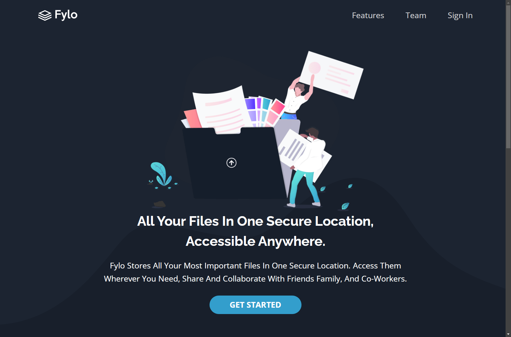

# Frontend Mentor - Fylo dark theme landing page solution

This is a solution to the [Fylo dark theme landing page challenge on Frontend Mentor](https://www.frontendmentor.io/challenges/fylo-dark-theme-landing-page-5ca5f2d21e82137ec91a50fd).

## Table of contents

- [Overview](#overview)
  - [The challenge](#the-challenge)
  - [Screenshot](#screenshot)
  - [Links](#links)
- [My process](#my-process)
  - [Built with](#built-with)
  - [Continued development](#continued-development)
- [Author](#author)
- [Acknowledgments](#acknowledgments)

## Overview

My own attempt to solve this challenge

### The challenge

Users should be able to:

- View the optimal layout for the site depending on their device's screen size
- See hover states for all interactive elements on the page

### Screenshot

### Links

- [Solution URL](https://www.frontendmentor.io/solutions/fylo-dark-theme-landing-page-rtah6eJxGO)
- [Live Site URL](https://ymhaah.github.io/fylo-dark-theme/)

## My process

The design is generally easy. There were a few annoying things in the design, but in general it was easy

### Built with

- Semantic HTML5 markup
- CSS custom properties
- Flexbox
- CSS Grid
- Mobile-first workflow

### Continued development

-   html seo
-   scss mixin

## Author

-   github - [youssef hafnawi](https://github.com/ymhaah)
-   Twitter - [@hafanwi](https://twitter.com/hafanwi)

